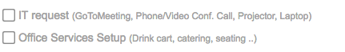
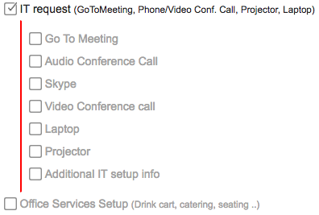
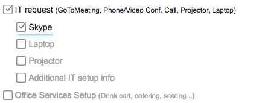

## Request Generator 

A better interface to complex request forms. It allows user to concentrate only on available and required choices relevant to the responses entered.  Providing only relevant options is aiding in reducing complexity significantly.  

It takes an advantage of conversational approach of  wizzard interface pattern without limitation of loss of content entered and context and ability of non-sequential content completion.

At the end of request text summary of request is generated that can be used in text based content correspondence such as email.

|  |
| :--: |
| *1. Initial screen with simple choice.* |

|  |
| :-: |
| *2. Once an item is selected it reveals choices and requirements available for it.  Red line  on left of subselections indicating that at least one choice needs to be made.* |

### Additional features

The implementation is allowing to to constrain one of many selection. Following the principal of reducing complexity selection of item in one of many hides other selection in the same set. 

|  |
| :--: |
| *In selection above from the communication types: Go To Meeting, Audio Conference Call, Skype and Video Conference call only one at a time can be used. With selection made others become hidden to reduce noise to signal ratio.* |

## Implementation - Angular 5. 

### Application State Management 

Content Service (ContentSerice) manages application state. 

__Container hierarhy traversal__. All request selection components extends common base class (Container) allowing uniform selection tree component traversal for building component state tree with connected components.  

ComponentService provides __save and restore service__, both local and remote, that saves state locally or remotly and allows to propogate restored state changes to connected components.  

__Summary generation.__ ComponentService also summarizes current state in description and provides stream of errorState updates in response to request selection changes.

## Components

### ContainerComponent 

An abstract base class that all components extend. It sets up common inputs:  
title,  
name,  
required

properties:  
path, - assigned after all components have been layed out based on location in component tree.
value - generic object extended in subclasses

behaviour:  
notifyChange - notify content service of local state changes  
applyNewValue - applies new local state based on content service request  

convenience getters:  
isRequired,  
isValid  

#ListComponent
Select item an item from list and provide editable option.
Inputs:
list - | (pipe) separated list of values, empty space forces new line
editableValue - if this value apppears in list it is editable (default - Other)
editFieldPlaceholder